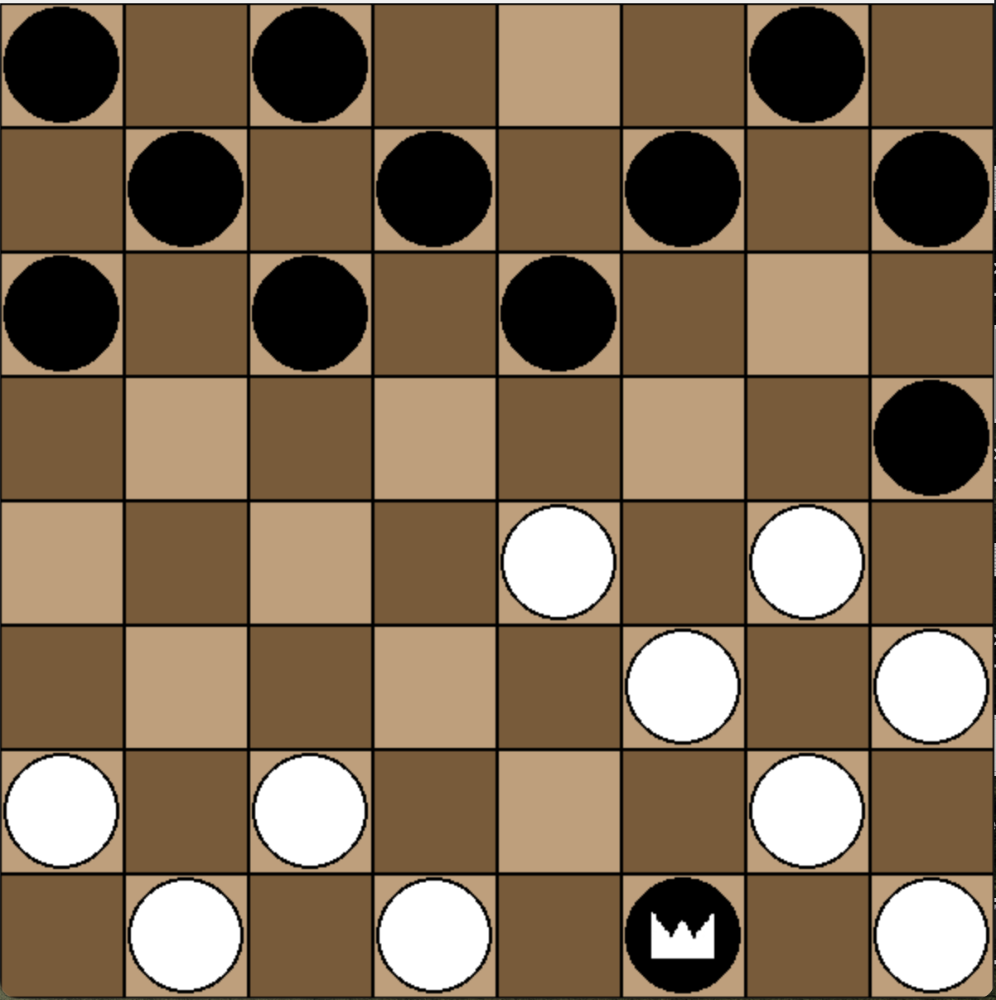

# Checkers Game

A Checkers game for 2 players built using **Python** and **Pygame**, 
featuring classical 8x8 board, piece movement, king promotion, move highlighting, and sound effects.


---
## Table of Contents
1. [Game Features](##Features)
2. [Project Structure](## Project Structure)
3. [Concurrency Methods](##concurrent-programming-methods)
4. [Libraries & Frameworks](##external-librariesframeworks)
5. [Screenshots](##screenshots)
6. [Setup & Installation](##setup--installation)
7. [How to Play](##ow-to-play)
8. [Group Member Contributions](##group-member-contributions)
9. [License](##license)


## Features

- Two-player local gameplay (server - client)
- Visual highlighting of legal moves
- Piece promotion to king
- Sound effects on moves
- Custom piece and board graphics
- Capture obligation (you need to capture an opponent's piece if possible)
- Handling if the one player quits

---

## Project Structure
```
 Checkers
  ├── resources
  │   ├── board2.png
  │   ├── king_black.png
  │   ├── king_white.png
  │   └── move_sound.wav
  │   
  ├── board.py
  ├── forwarding.py
  ├── graphics.py
  ├── piece.py
  ├── server.py
  ├── checkers.py
  ├── game.py
  ├── network.py
  ├── square.py
  └── README.md
```

## What to do to run the game?
#### 1st player [server]:
     1. python checkers.py
     2. type: 'h'
     3. wait for the second player (client) to connect

#### 2nd player [client]:
     1. python checkers.py
     2. type: 'j'
     3. type: '127.0.0.1' (ip of server)

## Requirements:
- Python 3.7+
- Pygame library installed

## Visual Demonstration:
##### start of a game


##### after clicking a piece (highlighting possible moves)


##### after clicking a piece (possible to capture a piece)


##### multiple capture + king transformation
<p float="left">
 
 
 
</p>

##### capture obligation (piece 2 can't move, because piece 1 can capture a piece)


##### king movement


##### Winner message


##### Opponent quit message


